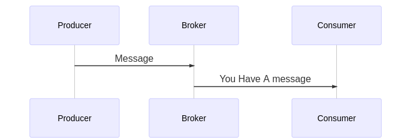
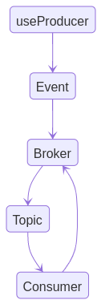

<p align="center"></p>

# Grafka
A Grandjs Package helper for applying event driver architecture on your monolothic application


## Content
- [Grafka](#grafka)
  - [Content](#content)
  - [About](#about)
  - [Features](#features)
  - [Prerequisites](#prerequisites)
  - [Dependencies](#dependencies)
  - [Installing](#installing)
  - [Usage](#usage)
  - [Architecture](#architecture)
  - [Grafka Event Life Cycle](#grafka-event-life-cycle)
  - [Broker](#broker)
  - [Topic](#topic)
  - [Producer](#producer)
  - [Consumer](#consumer)
    - [Using Consumer Decorator](#using-consumer-decorator)
    - [Using UseConsumer Method](#using-useconsumer-method)
  - [Use The Broker](#use-the-broker)
## About
Grafka is a typescript package that helps you write high scalable web application using event driven architecture inside your monolothic application, so instead of calling your services inside the other functions, you can easily inject your services inside Grafka brokers and just fire event from anywhere inside your application and your services will work as a charm!

## Features
- Applying Event Driven Architecture on the level of app
- Isolation between your services and controllers
- Connect your services, controllers, repositories event without injecting your dependencies

## Prerequisites
- install nodejs on your machine/javascript browser
- install typescript/javascript
- initialize a new typescript project/javascript project


## Dependencies
Grafka doesn't use dependencies to start using it unless you want to use Grafka decorators so you need to install and use typescript

## Installing
```javascript
npm i grafka
```
## Usage

Grafka exposes to you a set of functions and classes that you can use to build your brokers, events and so on
```typescript
import {Broker, UseBroker, Consumer, UseConsumer, Brokers, useProducer} from "grafka"
```
## Architecture


Grafka includes four main instances
- Broker:
    Grafka exposes a Broker class that you can extend to build your own broker, This broker basically stores your consumers and topics
- Topic:
    This is the path/name of message that your consumers inside the broker interested in
- Producer:
    This instance is resbonsible on producing messages and these messages are sent to the broker and listened by the event emitter
- Consumer:
    Each Topic inside a broker has group of consumers that they are interested in to get updates of that topic once a producer triggers an event

## Grafka Event Life Cycle



## Broker

Grafka Broker is an abstracted class that you can use to build a new broker instance which will host your topics, producers, consumers

**Example**

```typescript
import {Broker} from "grafka";
```


To create a new Grafka Broker instance, you just need to instantiate this class ass the following:

```typescript
import {Broker} from "grafka";

class UserBroker extends Broker{

}
```


Now You have an extended broker which you can use to add topics and consumers to it

## Topic
To define a new topic for this broker you can use a decorator called `Topic` this decorator is a function that takes one argument which is a string refers to the path of the topic you want to create

|property|type|required|description|
|-|-|-|-|
|topic|string|true|the path of the topic you want to create|

**Example**

```typescript
import {Broker, Topic} from "grafka";

@Topic("/notification")
class UserBroker extends Broker{

}
```

This will automatically inject a topic inside your broker, this topic path will be used later from the consumer to allow the consumer set the topics that it's interested in!


## Producer

Producer is something you use to produce/trigger an event related to specific topic inside a specific broker, once this event is triggered the interested consumers with this event topic will receive a notification about this topic

You can use this producer from anywhere inside your application, what you need is just use function called `useProducer` to trigger an event with the following parameters

|parameter|type|required|description|
|-|-|-|-|
|BrokerName|string|true|the name of the broker that you want to produce an event in|
|topic|string|true|A specific path that you want to trigger an event on|
|args|any|false|the rest of arguments you want to pass to the consumers that they will be called once you trigger an event related to specific topic|


```typescript

import {Broker, Topic, useProducer} from "grafka";

@Topic("/notification")
class UserBroker extends Broker{

}


const makeEvent = (username:string) => {
    // produce an event
    useProducer("UserBroker", "/notification", username);
}
```

As you can see the function we created will trigger an event once this function is called, this function takes one parameter which is a string that will sent it to the interested consuners once the event is triggered


## Consumer

This is the interested things in your broker topics, the consumer basically is a function that will be called once an event is triggered from a producer on a specific topic

You have different ways to register consumers into brokers as the following:

- Using `Consumer` decorator to decorate a method inside a class
- Using `UseConsumer` to inject the consumer into a specific broker


### Using Consumer Decorator

Grafka exposes to you a decorator function that you can use inside any class to inject this method as a consumer inside any broker you want, this decorator can be used if you are using typescript


**Example**

```typescript
import {Broker, Topic, useProducer, Consumer} from "grafka";

@Topic("/notification")
class UserBroker extends Broker{

}

class UserService {
    @Consumer(UserBroker, ["/notification"])
    receiveNotification() {}
}

const makeEvent = (username:string) => {
    // produce an event
    useProducer("UserBroker", "/notification", username);
}

```

`Consumer` Decorator takes the following parameters

|parameter|type|required|description|
|-|-|-|-|
|Broker|string/Broker|true|This parameter specifies which broker you want to inject this consumer in, this barameter can be a string to specify the name of the broker or can be a broker class instance|
|topics|Array(string)|true|specifies the topics that this consumer is interested in|
|args|any|false|the rest of arguments that you want to pass to the consumer when it's called once the event is triggered|

### Using UseConsumer Method

If you don't want to use decorators, you can use `UseConsumer` method which is can be used anywhere to inject a consumer into a specific broker

**Example**


```typescript
import {Broker, Topic, useProducer, Consumer, UseConsumer} from "grafka";

@Topic("/notification")
class UserBroker extends Broker{

}

const NotificationConsumer = () => {
    console.log("this is consumer");
}

UseConsumer(UserBroker || "userBroker", ["/notification"], NotificationConsumer)
const makeEvent = (username:string) => {
    // produce an event
    useProducer("UserBroker", "/notification", username);
}

```

`UseConsumer` takes the following parameters:

|parameter|type|required|description|
|-|-|-|-|
|Broker|string/Broker|true|This parameter specifies which broker you want to inject this consumer in, this barameter can be a string to specify the name of the broker or can be a broker class instance|
|topics|Array(string)|true|specifies the topics that this consumer is interested in|
|executer|function|true|a function should be executed when a producer fires an event related to one of this consumer topics|
|args|any|false|the rest of arguments that you want to pass to the consumer when it's called once the event is triggered|

When you use `UseConsumer` function or `Consumer` decorator, you can specify the topics that this consumer is interested in, if one of the specified topics is not defined in the broker before, the consumer function will add it automatically  to the specified broker topics

## Use The Broker

After defining the broker, now you need to use this broker to activate it and make it available to be consumed be producers and consumers, for that Grafka introduce a function called `UseBroker` this function can be used as a class decorator or can be used as a standalone function

`UseBroker` function parameters are as the following:

|parameters|type|required|description|
|-|-|-|-|
|Broker|Broker|true|this is the broker that you want to add to the consumed brokers|

**Exampl**
```typescript
import {Broker, Topic, useProducer, Consumer, UseConsumer, UseBroker} from "grafka";


@Topic("/notification")
class UserBroker extends Broker{

}
// use this broker
UseBroker(UserBroker);
```

If you want to use this function as a class decorator, you can write something like this:

**Exampl**
```typescript
import {Broker, Topic, useProducer, Consumer, UseConsumer, UseBroker} from "grafka";

// use this broker
@UseBroker
@Topic("/notification")
class UserBroker extends Broker{

}
```

**Note**
the `UseBroker` decorator should be used at the top of the class other decorators

